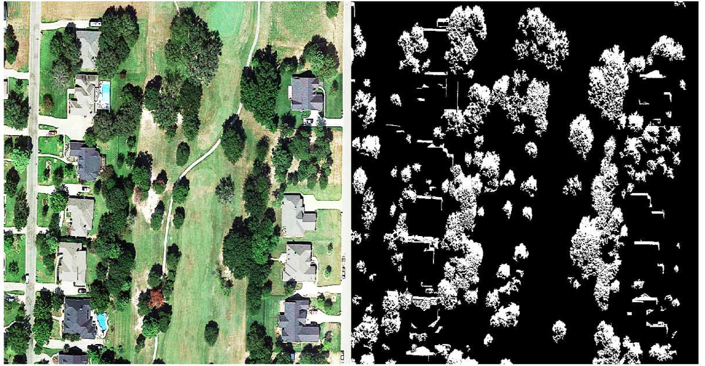
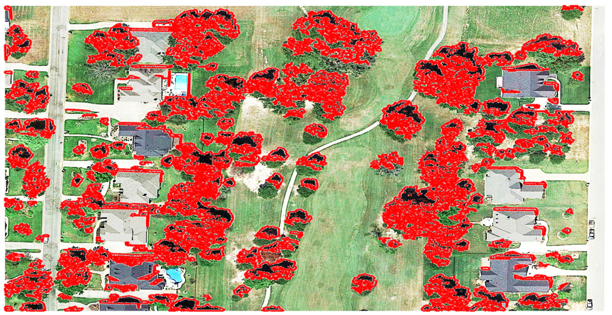

# Tree-Counting-in-Different-Scenarios-Using-Satellite-Remote-Sensing
This project employed MATLAB and Google Earth imagery to analyze and count trees in both dense and sparse landscapes. 
This project explores the use of advanced image processing techniques in MATLAB to accurately count trees in various environments using high-resolution satellite imagery from Google Earth. By applying methods such as histogram equalization, localbrighten, and morphological operations, we achieved tree counting accuracies of 84.6% in densely populated areas and 99% in sparsely populated regions. The study compares the effectiveness of different tree counting approaches across distinct landscapes, highlighting the influence of spatial resolution and scene complexity on the accuracy of results. Additionally, the project underscores the potential of integrating remote sensing with machine learning techniques to enhance tree detection and counting, offering a scalable solution for large-scale environmental monitoring and management.

.png)

